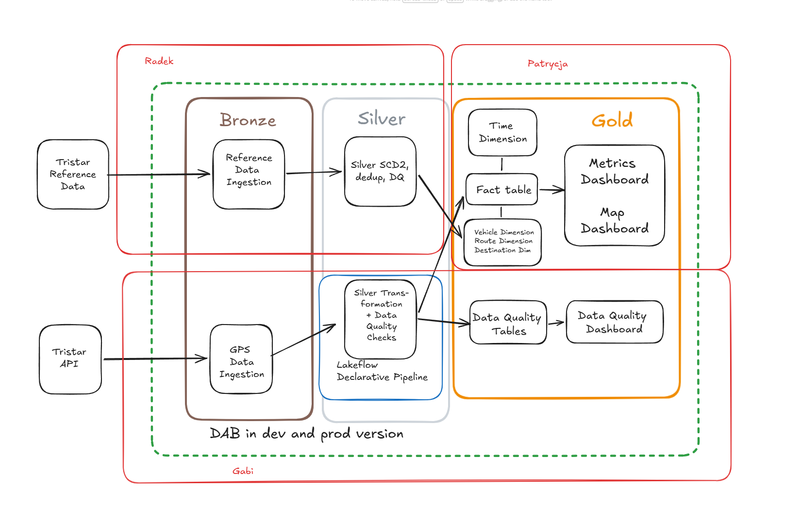

# Gdańsk Live Transit Monitor

A real-time data platform that ingests live GPS positions of Gdańsk public transport, enriches
them with static reference data, and serves them through a live map, an analytics dashboard and a
data-quality dashboard. It is built on **Azure Databricks** and **Unity Catalog**, follows a
medallion (bronze, silver, gold) architecture, and combines streaming and batch ingestion.

The whole project is packaged as a **Databricks Asset Bundle (DAB)** with two targets: `dev` runs on
Databricks Free Edition, and `prod` runs on the shared SoftServe Azure workspace. The silver layer
runs as a **Lakeflow declarative pipeline** with data-quality checks, and gold is a **star schema**
(fact plus dimensions) built on top of it.

---

## What it does

Vehicles across Gdańsk report their position to the city's Tristar transit API. This project streams
those positions through **Azure Event Hub** into a governed **bronze** layer, cleans, quality-checks
and enriches them in **silver**, models them into a **gold** star schema, and drives the dashboards.
Static GTFS schedules and the vehicle roster are loaded separately as batch reference data and kept as
**SCD Type 2** dimensions, so history is preserved when a route or vehicle attribute changes.

The platform also demonstrates **schema evolution**: how the streaming layer absorbs a new field
appearing at the source without breaking or losing data.

---

## Architecture



The diagram maps to how the work is split. The lower lane is the **streaming path**: the Tristar GPS
API feeds a producer, the producer sends events to Event Hub, and a consumer lands them in bronze.
The upper lane is the **batch path**: Tristar reference data (GTFS and roster) is ingested and turned
into SCD Type 2 silver dimensions. Both paths meet in the gold star schema, which feeds the metrics
dashboard, the map dashboard and the data-quality dashboard.

The green dashed box marks what is deployed by the Databricks Asset Bundle in both `dev` and `prod`.
Ownership: Gabriela owns GPS streaming ingestion, the silver declarative pipeline and the map; Radek
owns batch reference ingestion; Patrycja owns the gold layer, dashboards and infrastructure.

Everything lands in a **Unity-Catalog-governed** catalog (`dbr_dev` on prod, `workspace` on dev),
with credentials held in a **Key Vault-backed secret scope**.

---

## Assessment criteria and where they are met

This section maps the graded elements to the exact place they live in the repo, so each one can be
checked directly.

| Criterion | Where it lives | What to look at |
| --- | --- | --- |
| Medallion architecture | `bronze_streaming/`, `silver/`, `gold/` | bronze raw landing, silver clean and enriched, gold star schema |
| Streaming ingestion | `bronze_streaming/02_gps_consumer.ipynb` | Event Hub (Kafka endpoint) to bronze `gps_data` |
| Batch ingestion | `batch_ingestion/batch_gtfs.ipynb`, `batch_ingestion/batch_vehicles.ipynb` | GTFS routes and vehicle roster to bronze |
| Declarative pipeline (Lakeflow) | `silver/ldp_pipeline.py` | streaming tables and CDC dedup, defined declaratively |
| SCD Type 2 dimensions | `scd2/` | historized routes and vehicles with validity ranges |
| Gold star schema | `gold/05_gold_dimensions.ipynb`, `gold/06_gold_fact_vehicle_status.ipynb` | one fact table plus four dimensions |
| Serving aggregations | `gold/07_gold_aggregations.ipynb` | live KPI, fleet, route, delay and destination summaries |
| Data quality (DQX) | `silver/ldp_pipeline.py`, `gold/08_gold_dqx.ipynb`, Databricks SQL alert | in-pipeline checks, valid vs quarantine split, DQ tables, quarantine-rate alert |
| Unit tests | `silver/tests/` | pytest over the pure silver transformation |
| Orchestration (jobs) | `databricks.yml` | streaming job and batch dimension-refresh job |
| CI/CD readiness | `databricks.yml`, notebook widgets | DAB dev/prod targets, parameterised catalog and schema |
| Governance (Unity Catalog) | consumer and `databricks.yml` | catalog, schema, volume, external location, secret scope |
| Serving layer | `dashboards/`, `app.py` | AI/BI KPI dashboard, map dashboard, DQ dashboard, Streamlit map |
| Schema evolution demo | `schema_evolution/` | new field absorbed without breaking the stream |

---

## Repository structure

| Path | Purpose |
| --- | --- |
| `databricks.yml` | Asset Bundle: two targets (`dev` on Free Edition, `prod` on Azure), the two jobs, the pipeline and the dashboards. |
| `bronze_streaming/producer_eventhub.py` | Producer that polls the GPS API and sends events to Event Hub (runs on an Azure VM as a systemd service). |
| `bronze_streaming/01_gps_producer.ipynb` | Notebook variant of the producer, used for local development. |
| `bronze_streaming/02_gps_consumer.ipynb` | Streaming consumer: Event Hub (Kafka endpoint) to bronze `gps_data`. Provisions the schema, volume and external location. |
| `bronze_streaming/00_setup_dev_bronze.ipynb` | Dev seeder that fills bronze on Free Edition, where there is no live Event Hub. |
| `batch_ingestion/batch_gtfs.ipynb` | Batch load of static GTFS (routes, stops) to `bronze_gtfs_*`. |
| `batch_ingestion/batch_vehicles.ipynb` | Batch load of the vehicle roster to `bronze_vehicles`. |
| `scd2/create_silver_routes_scd.ipynb`, `scd2/silver_routes_scd.ipynb` | SCD Type 2 table and load for routes. |
| `scd2/create_silver_vehicles_scd.ipynb`, `scd2/silver_vehicles_scd.ipynb` | SCD Type 2 table and load for vehicles. |
| `silver/ldp_pipeline.py` | Lakeflow declarative pipeline: bronze to silver, DQX checks, valid vs quarantine split, CDC dedup. |
| `silver/silver_transformation.py` | Pure `add_derived_columns` transformation, imported by the pipeline and by the tests. |
| `silver/tests/` | pytest unit tests over the silver transformation. |
| `gold/05_gold_dimensions.ipynb` | Builds the dimensions: `dim_time`, `dim_vehicle`, `dim_route`, `dim_destination`. |
| `gold/06_gold_fact_vehicle_status.ipynb` | Builds the fact table `fact_vehicle_status`, joined to the four dimension keys. |
| `gold/07_gold_aggregations.ipynb` | Serving tables: `gold_fleet_current`, `gold_live_kpi`, `gold_route_summary`, `gold_delay_distribution`, `gold_destination_summary`, `gold_period_summary`. |
| `gold/08_gold_dqx.ipynb` | Data-quality tables from the DQX split plus reconciliation between layers. |
| `schema_evolution/06_schema_evolution_demo.py` | Isolated demo pipeline showing schema evolution (new `occupancy` field) into `gps_data_demo`. |
| `schema_evolution/demo_producer.py` | On-demand local producer that injects synthetic events carrying the new field. |
| `dashboards/Gdansk Live Transit Monitor.lvdash.json` | AI/BI (Lakeview) KPI dashboard definition. |
| `dashboards/Live Transit Map.lvdash.json` | AI/BI live map, fleet positions coloured by delay. |
| `dashboards/Data Quality Dashboard.lvdash.json` | AI/BI data-quality dashboard over the DQ tables. |
| `app.py` | Streamlit live map (in progress), reads gold through the Databricks SQL connector. |

---

## Medallion layers

### Bronze, raw and governed landing
The streaming consumer (`02_gps_consumer`) reads Event Hub over the Kafka protocol (`:9093`,
`SASL_SSL` / `PLAIN`), parses each event with a fixed `from_json` schema (field names match the API
camelCase one to one), and appends to `gps_data` with `writeStream ... toTable(...)` using
`mergeSchema`. It adds metadata columns (`_source`, `ingestion_ts`, `event_time`, `enqueued_ts`,
`partition`, `offset`) and tracks offsets in a checkpoint on ADLS, so restarts pick up where they left
off. On Free Edition there is no live Event Hub, so `00_setup_dev_bronze` seeds bronze instead. Batch
GTFS and the roster are loaded with idempotent Delta `MERGE` on natural keys, with `source_file`,
`ingestion_timestamp` and `load_date` metadata.

### Silver, a declarative pipeline with data quality
Silver is a **Lakeflow declarative pipeline** (`silver/ldp_pipeline.py`), not a plain notebook. It
reads bronze `gps_data` as a stream, applies the pure `add_derived_columns` transformation, and then
runs **Databricks Labs DQX** checks declared as metadata. The pipeline produces four tables:

- `gps_positions_silver_checked`: every row, with DQX `_errors` and `_warnings` attached.
- `gps_positions_silver_valid`: rows that passed the error-level checks, with the helper columns dropped.
- `gps_positions_quarantine`: rows that failed, kept with their error detail for inspection.
- `gps_positions_silver`: the final table, built from the valid stream with an idempotent CDC dedup
  (`create_auto_cdc_flow`, keyed on `vehicleId` and `generated`, sequenced by `event_time`).

The DQX checks cover completeness (`vehicleId`, `lat`, `lon` not null), validity (the Gdańsk bounding
box `lat 54.2 to 54.6`, `lon 18.3 to 19.0`, which drops the null-island `(0,0)` points that survive
`isNotNull`), and a warning when `gpsQuality` is low. `add_derived_columns` produces `delay_min`,
`delay_bucket` (early, on_time, delayed), `is_delayed`, `is_stopped`, `is_moving`, `has_trip`,
`gps_ok`, and `event_time_local` in `Europe/Warsaw`.

Reference data lands as SCD Type 2 (`scd2/`): `silver_routes_scd` and `silver_vehicles_scd` keep a
row per version of a route or vehicle with a validity range, so past positions still join to the
attributes that were correct at the time.

### Gold, a star schema and serving tables
Gold is split into three notebooks. `05_gold_dimensions` builds the dimensions (`dim_time`,
`dim_vehicle`, `dim_route`, `dim_destination`), sourced from silver and the SCD tables.
`06_gold_fact_vehicle_status` builds the fact table `fact_vehicle_status`, joining silver positions to
the dimension keys (`vehicle_key`, `route_key`, `destination_key`, `time_key`).
`07_gold_aggregations` writes the serving tables the dashboards read, including `gold_fleet_current`
(latest position per vehicle, the source of the live map), plus route, delay-distribution,
destination, live-KPI and period summaries. `08_gold_dqx` turns the DQX split into data-quality
tables (`gold_dq_reasons`, `gold_dq_by_reason`, `gold_dq_top_offenders`, `gold_dq_trend`,
`gold_dq_warnings`) and a `gold_reconciliation` check between layers.

---

## Data quality

Quality is enforced at three points. Inside the silver pipeline, DQX splits the stream into a valid
table and a quarantine table, so bad rows are kept and inspectable rather than silently dropped. In
gold, `08_gold_dqx` summarises those rows into scorecards (failures by reason, top offenders, a trend
over time, warnings) and runs a reconciliation between bronze, silver and gold to catch silent losses
between layers. The `Data Quality Dashboard` reads these tables, and the streaming job refreshes it on
every run.

On top of that, a **Databricks SQL alert** watches the quarantine rate and notifies by email when it
crosses a threshold. The query measures the share of rows sent to quarantine over the last day
(`quarantine_pct`), with a minimum row count so a quiet window does not raise a false alarm. In normal
operation the rate sits near 0.5 percent, so the alert is set to fire at 2 percent, which is well above
the baseline but still catches a real drop in feed quality.


---

## Testing

`silver/tests/` holds pytest unit tests over the pure `add_derived_columns` function. The tests build
tiny hand-made DataFrames and assert on the derived columns: timestamp casting, `delay_min` rounding,
and the UTC to `Europe/Warsaw` conversion. Because the logic is a plain function with no table reads
or `spark.conf.get` calls, the tests run without touching the catalog, which keeps them fast and
CI-friendly. `conftest.py` reuses the active Spark session.

---

## Governance (Unity Catalog)

- **Catalog, schema, volume**: `dbr_dev.live_transit_monitor.project_volume` on prod, `workspace` on
  dev. The schema and volume are provisioned idempotently (`CREATE ... IF NOT EXISTS`) inside the
  consumer; the shared catalog is an assumed prerequisite.
- **External location**: `live-transit-monitor` (container `live-transit-monitor` on storage account
  `dlspl21databricks`, backed by storage credential `databricks_uc_connector`), created in-code with
  `CREATE EXTERNAL LOCATION IF NOT EXISTS`.
- **Secrets**: the Event Hub listen connection string lives in a **Key Vault-backed** secret scope
  (`default2`, key `eh-conn-transit`), backed by Azure Key Vault `kvpl24databricks2`.

---

## Orchestration

Two Databricks jobs are defined in `databricks.yml` and deployed by the bundle.

**Streaming job (`transit_gps_stream`)** runs the live path.


The task chain is `bronze` to `silver_ldp` (the declarative pipeline) to the gold notebooks
(`gold_dimensions`, then `gold_fact`, then `gold_aggregations`), with `gold_data_quality` running off
silver in parallel. Dashboard refreshes fan out at the end: the DQ dashboard after the DQ tables, and
the live and map dashboards after the aggregations. The consumer drains with
`trigger(availableNow=True)`, so each run finishes and the downstream tasks fire in order.

**Batch job (`dimension_refresh`)** runs on a slower cadence and keeps the reference dimensions current.


GTFS and the roster are ingested (`batch_gtfs`, `batch_vehicles`), the SCD tables are created if
missing, the SCD loads run (`silver_routes_scd`, `silver_vehicles_scd`), and gold dimensions are
refreshed. This job is separate from the streaming job on purpose, so reference data is not re-loaded
on every streaming cycle.

### Parameters
Environment-specific values are exposed as bundle variables and notebook widgets rather than
hard-coded, so the same code targets another catalog or schema without changes:

| Key | Dev default | Prod value |
| --- | --- | --- |
| `catalog` | `workspace` | `dbr_dev` |
| `bronze_schema` / `silver_schema` | `live_transit_monitor` | `live_transit_monitor` |
| `starting_offsets` | (consumer) `earliest` | `earliest` |

---

## Serving

- **AI/BI KPI dashboard** (`Gdansk Live Transit Monitor`): KPIs and summary tables over the gold
  serving tables, on a serverless SQL warehouse.
- **AI/BI live map** (`Live Transit Map`): a Lakeview dashboard that plots `gold_fleet_current` on a
  point map, coloured by delay bucket, refreshed on a schedule off the gold tables.
- **Data Quality Dashboard**: pass rates and offenders from the gold DQ tables.
- **Streamlit live map** (`app.py`): in progress. A Folium map that reads `gold_fleet_current` through
  the Databricks SQL connector and auto-refreshes every 20 seconds, so a non-Databricks audience can
  see the live fleet outside the workspace.

---

## Schema-evolution demo

A deliberately isolated second pipeline (`schema_evolution/06_schema_evolution_demo.py`) reads the
same Event Hub but writes to a separate table (`gps_data_demo`) with its own checkpoint, so the
production pipeline and map are never touched. It shows that when a new `occupancy` field appears at
the source, the stream keeps running, the raw event is preserved (rescued `raw_value`), and the bronze
table gains the new column automatically once the schema is promoted (`mergeSchema`).

---

## Running it

**Prerequisites**
- The Databricks CLI with a bundle auth profile per target (each person runs `databricks auth login`;
  the CLI matches the profile by host, so `databricks.yml` carries only the host, not a profile name).
- For `prod`: an Azure Databricks workspace with Unity Catalog and access to the shared `dbr_dev`
  catalog, an Event Hub with a listen connection string in the Key Vault-backed scope `default2`, and
  a running producer feeding it (Azure VM systemd service).
- For `dev`: a Databricks Free Edition workspace. There is no live Event Hub, so bronze is seeded.

**Steps**
1. Deploy the bundle to a target: `databricks bundle deploy -t dev` (or `-t prod`).
2. Run the batch job once to populate reference data and SCD dimensions:
   `databricks bundle run dimension_refresh -t dev`.
3. Run the streaming job: `databricks bundle run transit_gps_stream -t dev`.
4. Open the AI/BI dashboards, or run the Streamlit app locally:
   ```bash
   pip install -r requirements.txt
   streamlit run app.py
   ```

---

## Team

| Area | Owner |
| --- | --- |
| Streaming ingestion, silver declarative pipeline, live map, schema-evolution demo | Gabriela |
| Batch ingestion (GTFS and vehicles) | Radek |
| Gold layer, dashboards, infrastructure and repository, Event Hub retention | Patrycja |

---

## Notes and known limitations

- **Batch reference loads are insert-idempotent at ingest.** The bronze GTFS and roster merges insert
  new keys but do not update existing ones. Attribute history is captured later, in the SCD Type 2
  silver dimensions.
- **Delta table constraints** apply to regular tables the project owns, not to pipeline-managed
  tables, so table-level `CHECK` constraints are demonstrated on owned gold tables rather than on the
  pipeline outputs.
- **Dashboards query silver and gold**, not raw bronze. The transformations and joins the visuals need
  live in those layers.
- **Cost**: dev runs on Free Edition serverless; prod jobs are scheduled paused and enabled for a live
  window, streams drain with `availableNow` in development, and dashboard refreshes are paused when not
  in use.
