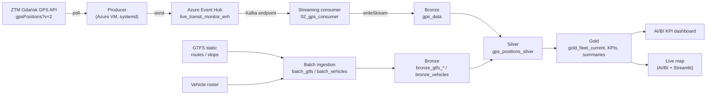

# Gdańsk Live Transit Monitor

A real-time data platform that ingests live GPS positions of Gdańsk public transport,
enriches them with static reference data, and serves them through a live map and analytics
dashboard. Built on **Azure Databricks** and **Unity Catalog**, following a medallion
(bronze → silver → gold) architecture with both streaming and batch ingestion.

---

## What it does

Vehicles across Gdańsk report their position to the city's transit API. This project streams
those positions through **Azure Event Hub** into a governed **bronze** layer, cleans and
enriches them in **silver**, aggregates them into serving tables in **gold**, and drives a
live-updating map and KPI dashboard. Static GTFS schedules and the vehicle roster are loaded
in parallel as batch reference data and joined in during enrichment.

The platform also demonstrates **schema evolution**: how the streaming layer absorbs a new
field appearing at the source without breaking or losing data.

---

## Architecture



Everything lands in a **Unity-Catalog-governed** catalog (`dbr_dev`), with credentials held in
a **Key Vault-backed secret scope**.

---

## Repository structure

| Path | Purpose |
| --- | --- |
| `producer_eventhub.py` | Producer that polls the GPS API and sends events to Event Hub (runs on an Azure VM as a systemd service). |
| `01_gps_producer.ipynb` | Notebook variant of the producer, used for local development. |
| `02_gps_consumer.ipynb` | Streaming consumer: Event Hub (Kafka endpoint) → **bronze** `gps_data`. Provisions the schema/volume and external location. |
| `batch_ingestion/batch_gtfs.ipynb` | Batch load of static GTFS (routes, stops) → `bronze_gtfs_*`. |
| `batch_ingestion/batch_vehicles.ipynb` | Batch load of the vehicle roster → `bronze_vehicles`. |
| `04_silver_layer.ipynb` | Cleans, dedups, enriches and geo-filters bronze → **silver** `gps_positions_silver`. |
| `05_golden_layer.ipynb` | Aggregates silver → **gold** serving tables (fleet, KPIs, route/delay/destination summaries). |
| `06_schema_evolution_demo.py` | Isolated demo pipeline showing schema evolution (new `occupancy` field) into `gps_data_demo`. |
| `demo_producer.py` | On-demand local producer that injects synthetic events carrying the new field. |
| `DEMO_RUNBOOK.md` | Step-by-step runbook and narration for the schema-evolution demo. |
| `Gdansk Live Transit Monitor.lvdash.json` | AI/BI (Lakeview) KPI dashboard definition. |
| `Live Transit Map.lvdash.json` | AI/BI (Lakeview) live map dashboard — fleet positions coloured by delay. |
| `app.py` | Streamlit live map — **in progress**; reads gold via the Databricks SQL connector. |

---

## Medallion layers

### Bronze — raw, governed landing
- **Streaming**: `02_gps_consumer` reads Event Hub over the Kafka protocol (`:9093`,
  `SASL_SSL` / `PLAIN`), parses each event with a fixed `from_json` schema (field names match
  the API camelCase 1:1), and appends to `gps_data` with `writeStream ... toTable(...)` using
  `mergeSchema`. Metadata columns are added: `_source`, `ingestion_ts`, `event_time`,
  `enqueued_ts`, `partition`, `offset`. Offsets are tracked in a checkpoint on ADLS, so restarts
  are exactly-once.
- **Batch**: GTFS schedules and the vehicle roster are loaded with idempotent Delta `MERGE`
  (keyed on natural keys) plus `source_file` / `ingestion_timestamp` / `load_date` metadata.

### Silver — clean, typed, enriched
`04_silver_layer` produces `gps_positions_silver`:
- deduplication on `vehicleId` + `generated`, typed timestamps;
- derived fields: `delay_min`, `delay_bucket` (early / on_time / delayed), `is_delayed`,
  `is_stopped`, `is_moving`, `has_trip`, `gps_ok`;
- **Gdańsk bounding-box filter** (`lat 54.2–54.6`, `lon 18.3–19.0`) to drop null-island `(0,0)`
  points that survive `isNotNull`;
- `event_time_local` in `Europe/Warsaw` (source `event_time` is UTC);
- joins to `bronze_vehicles` (by `vehicleCode`: type, brand, model, capacity, carrier) and to
  `bronze_gtfs_routes` (by `route_id`: line colours). `transportationType` is normalised to
  English (`Bus` / `Tram`).

### Gold — serving
`05_golden_layer` writes the tables the dashboards consume, notably `gold_fleet_current` (the
latest position per vehicle — the source of the live map), plus route, delay-distribution,
destination and period summaries.

---

## Governance (Unity Catalog)

- **Catalog / schema / volume**: `dbr_dev.live_transit_monitor.project_volume`. The schema and
  volume are provisioned idempotently (`CREATE ... IF NOT EXISTS`) inside the consumer; the
  shared `dbr_dev` catalog is an assumed prerequisite.
- **External location**: `live-transit-monitor` (container `live-transit-monitor` on storage
  account `dlspl21databricks`, backed by storage credential `databricks_uc_connector`), created
  in-code with `CREATE EXTERNAL LOCATION IF NOT EXISTS`.
- **Secrets**: the Event Hub listen connection string lives in a **Key Vault-backed** secret
  scope (`default2`, key `eh-conn-transit`), backed by Azure Key Vault `kvpl24databricks2`.

---

## Schema-evolution demo

A deliberately **isolated** second pipeline (`06_schema_evolution_demo.py`) reads the *same*
Event Hub but writes to a separate table (`gps_data_demo`) with its own checkpoint, so the live
production pipeline and map are never touched. It shows that when a new `occupancy` field appears
at the source, the stream keeps running, the raw event is preserved (rescued `raw_value`), and
the bronze table gains the new column automatically once the schema is promoted (`mergeSchema`).
See [`DEMO_RUNBOOK.md`](./DEMO_RUNBOOK.md) for the full sequence and narration.

---

## Orchestration

The streaming pipeline runs as a **Databricks Job** with a dependent task chain:

```
GPS_consumer → Silver_Layer → Gold_Layer → (Dashboard refresh)
```

- The consumer uses `trigger(availableNow=True)` (a finite drain), so each run completes and the
  downstream tasks fire in order.
- For a live window, the whole job is scheduled to run every minute; the dashboard refreshes on
  its own schedule off the same gold tables.
- Static reference data (GTFS / roster) is loaded by a **separate** job on a slower cadence — it
  is not re-run on every streaming cycle.

### Parameters
Environment-specific values are exposed as job/notebook parameters (rather than hard-coded), so
the pipeline is CI/CD-ready and can target another catalog without code changes:

| Key | Default |
| --- | --- |
| `catalog` | `dbr_dev` |
| `schema` | `live_transit_monitor` |
| `starting_offsets` | `earliest` (consumer only) |

---

## Serving

- **AI/BI KPI dashboard** (`Gdansk Live Transit Monitor`) — KPIs and summary tables, running on a
  serverless SQL warehouse over the gold/silver tables.
- **AI/BI live map** (`Live Transit Map`) — a Lakeview dashboard that plots `gold_fleet_current` on
  a point map, colouring vehicles by delay bucket, refreshed on a schedule off the gold tables.
- **Streamlit live map** (`app.py`) — *in progress / potential for production.* A Folium map that
  reads `gold_fleet_current` through the Databricks SQL connector and auto-refreshes every 20 s,
  intended to let a non-Databricks audience view the live fleet outside the workspace.

---

## Running it

**Prerequisites**
- An Azure Databricks workspace with Unity Catalog and access to the shared `dbr_dev` catalog.
- An Event Hub with a listen connection string stored in the Key Vault-backed scope `default2`.
- A running producer feeding the Event Hub (Azure VM `systemd` service, or `01_gps_producer` for
  local testing).

**Steps**
1. Import the notebooks into the workspace.
2. Run `02_gps_consumer` once to provision the schema/volume and external location and drain
   bronze; run the batch notebooks once to populate `bronze_gtfs_*` and `bronze_vehicles`.
3. Run `04_silver_layer` and `05_golden_layer`, or wire all three into the Job DAG above.
4. Open the AI/BI dashboard, or run the Streamlit app locally:
   ```bash
   pip install -r requirements.txt
   streamlit run app.py
   ```

---

## Team

| Area | Owner |
| --- | --- |
| Streaming ingestion, silver, live map, schema-evolution demo | Gabriela |
| Infrastructure & repository, dashboard & gold layer, Event Hub retention | Patrycja |
| Batch ingestion (GTFS & vehicles) | Radek |

---

## Notes & known limitations

- **Batch reference loads are insert-idempotent, not full upserts.** The GTFS / roster merges
  insert new keys but do not update existing ones; the reference data is treated as append-only
  slowly-changing data. Adding `whenMatchedUpdateAll()` would make them true upserts if attribute
  changes ever need to be reflected.
- **Dashboards query silver/gold**, not raw bronze — the transformations and joins needed for the
  visuals live in those layers.
- **Cost**: all-purpose compute is the main cost driver; jobs use auto-termination, streams run
  with `availableNow` during development, and scheduled refreshes are paused when not in use.
